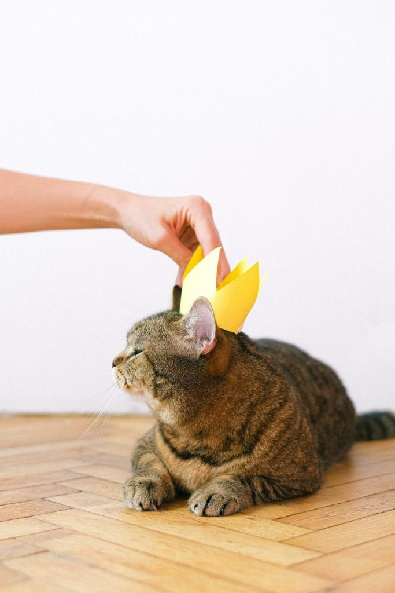

...

# Entrez à vos risques et périls.

Vous entrez en terrain miné pour votre tranquillité d'esprit. Vous risquez d'être outré(e) à plusieurs reprises en parcourant ce blog. Rassurez-vous, c'est bon pour votre santé mentale générale ainsi que celle de vos proches: on doit tous passer par là. Si vous avez été assez malchanceux pour que rien, dans votre petite vie, ne vienne perturber vos croyances préconçues, c'est votre heure de gloire.

* * *

## Ce blog parle majoritairement d'autisme.

* * *

Mais pas que. Il n'est plus tout à fait actif, mais constitue une sorte d'archive en ligne, sur le moment transitoire d'une femme autiste qui découvre les joies d'être associée à ce diagnostic. On qualifie l'autisme de "trouble": je ne suis cependant pas troublée, mais troublante. Cela m'a valu de nombreuses péripéties, dont une partie sont répertoriées ici.

J'ai poursuivi mes attentats à la pudeur littéraire ailleurs, sur Internet. Si vous êtes parmi les plus fortunés, vous savez où me trouver. Si j'ai des pensées profondes relatives à l'autisme, je viendrai peut-être l'ajouter ici, qui sait. L'anonymat me sied mieux pour raconter n'importe quoi et semer la terreur chez les bonnes gens.

Vous verrez peut-être des publicités, sur ce blog: elles ne sont pas de mon fait, mais de la société qui héberge ma logorrhée et ce nom de domaine pour un prix dérisoire. Si elles sont de mauvais goût, vous ne pouvez que blâmer votre historique douteux.

**Mise à jour au 24/06/2021** : après 5 ans de procrastination, j'ai finalement auto-hébergé ce blog. Vous n'aurez donc ni pubs, ni traçage de vos activités par la CIA, ni balises Google, car je me fous de ce que vous faites ici, personnellement. Je l'utilise comme une sorte de brouillon pour du design, je vous conseille donc :

1. de faire le deuil de toute velléité d'esthétisme.
2. de vous préparer psychologiquement à voir BEAUCOUP DE CHATS.

* * *

- Pour toute demande d'ordre professionnelle RÉMUNÉRÉE ( lisez bien ), vous pouvez me contacter par mail.

- Pour toute demande d'ordre affective ou de travail émotionnel, une facture vous sera adressée avec un taux horaire exorbitant (les affaires sont les affaires).


