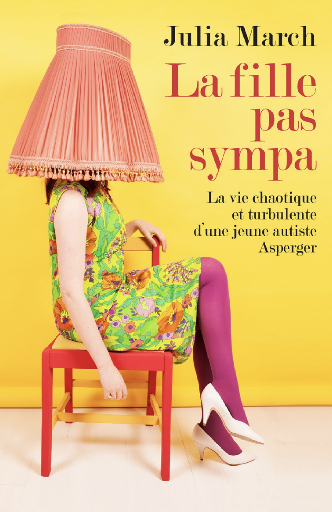

## "Imagine : 

Autour de toi, des personnes qui parlent dans une autre langue que la tienne depuis ta naissance, qui se comprennent et plaisantent entre elles. Tu es là, tu les regardes faire, mais sans comprendre.

Parfois, tu aimerais bien entrer dans la danse, faire partie de ce joyeux brouhaha, mais une frontière invisible que tu es seule à voir vous sépare. La plupart du temps, cette distance n’est pas gênante. Tu n’as jamais eu conscience de ne pas faire partie des leurs, jusqu’au jour où on te l’a hurlé, jusqu’au jour où quelqu’un t’a démasquée et que tous les regards se sont tournés vers toi avec suspicion. Tu ne sais pas exactement quand c’est arrivé, en revanche tu as appris la leçon : passer inaperçue, te fondre dans la masse, performer la normalité. Tout cela n’était pas négociable, c’était même devenu une question de survie. Des années plus tard, j’ai appris à me créer ce « joyeux brouhaha », à m’inventer une danse sociale bien à moi et, mieux encore, à y entraîner par inadvertance ceux qui croisaient distraitement mon chemin. Ce livre est dédié à tous les chelous, les ratés, les tarés, les anormaux, les excentriques, les fous, les incorrigibles, les inéducables, les pas sortables… Et à tous ceux qui, derrière leur écran de normalité, se regardent seuls dans le miroir en se demandant : « C’est quoi, mon problème ? ".

**Et oui, on m'a vraiment proposé de coucher ma life sur du vrai papier, fait à partir de vrais arbres.**

Pour l'acheter (version papier d'arbre ou Kindle) ou recevoir un extrait, c'est [ici](https://www.amazon.fr/fille-pas-sympa-March-Julia/dp/B075G1M88T/ref=sr_1_1?ie=UTF8&qid=1520348545&sr=8-1&keywords=la+fille+pas+sympa) 

Pour le recevoir directement de l'éditeur c'est [par là](http://www.editions-seramis.fr/accueil/10-la-fille-pas-sympa.html)
