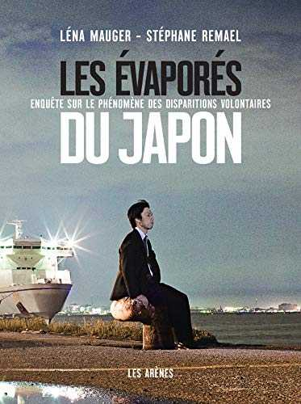

### J'aime classer des concepts de façon obscure pour les néophytes en tout genre, selon un système inspiré de mes dernières lubies.

Apprendre n'est pas un processus qui se fait sur une période déterminée et Internet est une source intarissable de sagesse et de conneries, dont je tire mes plus grandes leçons de vie. J'inaugure la rubrique NEURANATOMIE, dédiée au partage de liens et de ressources intra ou extra numériques, disséquée en quatre catégories :

Le schéma : un fait énoncé sans pincettes.

[**La cervelette**](https://fr.wikipedia.org/wiki/Cervelet) : La lecture plus longue et / ou approfondie du moment.

La dopamine : Tout ce qui est relatif à la prise de risques et à la mise en mouvement. Inspirations pour se sortir les phalanges du séant, globalement.

La sérotonine : Susceptible de favoriser l'état de bonheur.

Sans transition, la Neuranatomie de la semaine.

* * *

#1

### Le schéma

L'obsession normopathe d'une société est proportionnelle au taux d'inadaptés qu'elle produit. Par conséquent, disparaître de cette société sans laisser de traces est un art que tout inadapté devrait apprendre à maîtriser à la perfection.

### La cervelette

Connaissez-vous le dicton japonais "Il faut taper sur la tête du clou qui dépasse" ?

C'est probablement de ce dicton que s'inspirent les écoles nippones de redressement des cadres. L'objectif : "remettre les employés _imparfaits_ dans le droit chemin de l'ordre et l'obéissance".

J'ai lu _Les évaporés du Japon_, de Léna Mauger et Stéphane Remael, pendant le confinement de mars 2020. Où échouent les 100 000 Japonais qui s'évaporent chaque année sans laisser de traces ? C'est aux éditions Les Arènes. Une claque documentaire pour les néophytes de l'évaporation volontaire. Une sensation de familiarité pour les experts en la matière.

C'est [**ici**](https://www.arenes.fr/livre/les-evapores-du-japon/) pour le trouver.

### La dopamine

> stop waiting for other people to tell you that you’re amazing. decide you’re amazing and wait for everybody else to catch up.
> 
> _Cesse d'attendre que les autres te disent que tu es exceptionnel-le. Décide que tu es exceptionnel-le_ _et attends que le reste du monde se mette à la page._
> 
> **[@LilNasx](https://twitter.com/LilNasX),** 16 mai 2021

### La sérotonine

https://soundcloud.com/lala-ace-667/in-luv-again-1
